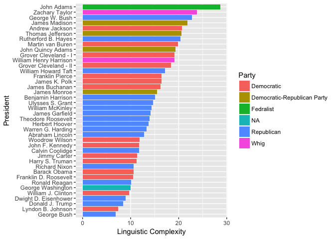
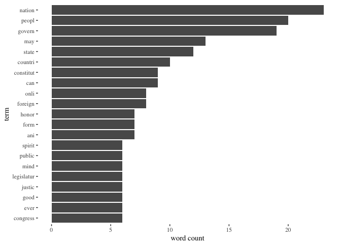
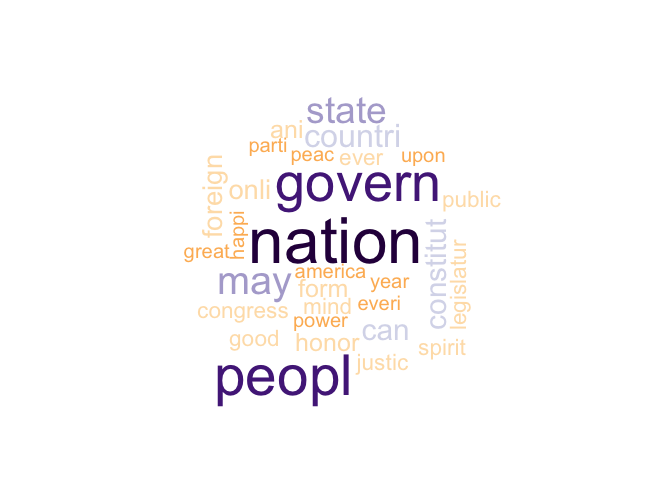
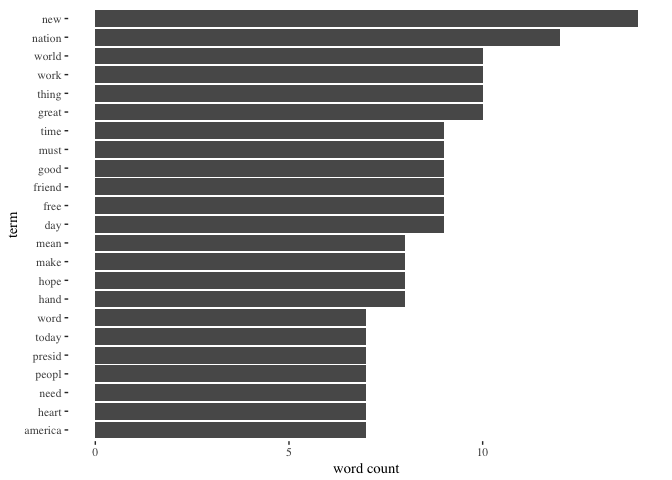
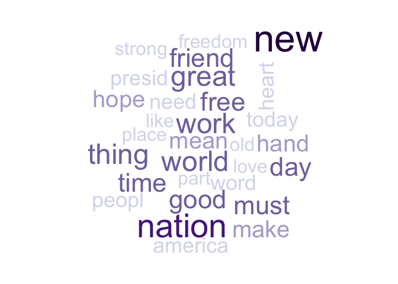
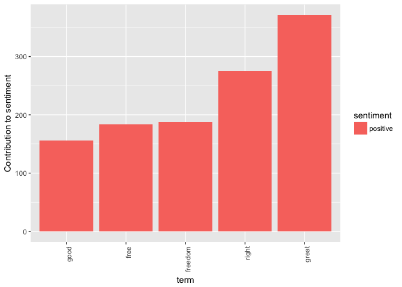
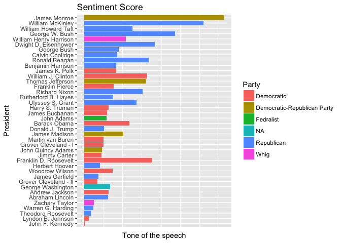
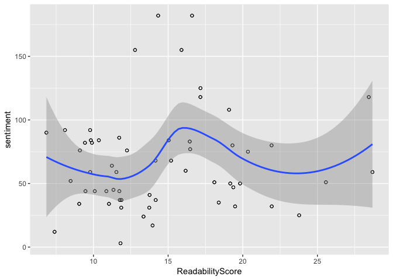

Project 1: Linguistic Complexity and Sentiment Level of US Presidents' Inaugural Speeches
================
Stephanie Park
9/20/2017

``` r
packages.used=c("rvest", "tibble", "qdap", 
                "sentimentr", "gplots", "dplyr",
                "tm", "syuzhet", "factoextra", 
                "beeswarm", "scales", "RColorBrewer",
                "RANN", "tm","qdapDictionaries",
                "tidytext","quanteda","stringr","readr",
                "ggplot2","ggthemes","wordcloud","xlsx","tidyr","topicmodels")


# check packages that need to be installed.
packages.needed=setdiff(packages.used, 
                        intersect(installed.packages()[,1], 
                                  packages.used))
# install additional packages
if(length(packages.needed)>0){
  install.packages(packages.needed, dependencies = TRUE)
}

# load packages
library("rvest")
library("tibble")
library("qdap")
library("sentimentr")
library("gplots")
library("dplyr")
library("tm")
library("syuzhet")
library("factoextra")
library("beeswarm")
library("scales")
library("RColorBrewer")
library("RANN")
library("tm")
library("qdapDictionaries")
library("tidytext")
library("quanteda")
library("stringr")
library("readr")
library("ggplot2")
library("ggthemes")
library("wordcloud")
library("xlsx")
library("tidyr")
library("topicmodels")
```

This notebook was prepared with the following environmental settings.

``` r
print(R.version)
```

    ##                _                           
    ## platform       x86_64-apple-darwin15.6.0   
    ## arch           x86_64                      
    ## os             darwin15.6.0                
    ## system         x86_64, darwin15.6.0        
    ## status                                     
    ## major          3                           
    ## minor          3.3                         
    ## year           2017                        
    ## month          03                          
    ## day            06                          
    ## svn rev        72310                       
    ## language       R                           
    ## version.string R version 3.3.3 (2017-03-06)
    ## nickname       Another Canoe

Data Preparation
----------------

### Reading the data sets

``` r
speech.list = read.xlsx("../data/InaugurationInfo.xlsx",1, stringsAsFactors = FALSE)
inaugDates.list = read.table("../data/InauguationDates.txt",header = TRUE, fill = TRUE)
```

### Transforming the text files into a corpus file

``` r
corpus_file <- Corpus(DirSource(directory = "../data/InauguralSpeeches/", pattern = "*.txt"))
corpus_file <- corpus(corpus_file$content, docvars = corpus_file$dmeta)
```

### Adding Readability based on Flesch Kincaid Linguistic Complexity Scale

``` r
Fre_cor <- textstat_readability(corpus_file,
              measure = c('Flesch.Kincaid'))
Fre_cor <- as.data.frame(Fre_cor)
Fre_cor$order <- 1:nrow(Fre_cor) 
Fre_cor$ReadabilityScore <- Fre_cor$Fre_cor 
speech.list <- as.data.frame(speech.list)
speech.list <- speech.list[order(speech.list$President),]
speech.list$order <- 1:nrow(speech.list)
ReadabilityScore <- merge(Fre_cor,speech.list,by="order")
```

Linguistic Complexity (Readability) by President
------------------------------------------------

``` r
p <- ggplot(data = ReadabilityScore, aes(x = reorder(President, ReadabilityScore), y = ReadabilityScore, fill = Party)) +
  stat_summary(fun.y="mean", geom="bar") +
  xlab("President") +
  ylab("Linguistic Complexity")
p <- p + coord_flip()
p
```



Based on the graph, John Adam's inaugural speech had the highest linguistic complexity, and George Bush had the lowest. I took a further look at what words these presidents' speeches included.

### John Adam's text data cleaning

``` r
JohnAdams <- Corpus(DirSource(directory = "../data/InauguralSpeeches/", pattern = "JohnAdams"))
JohnAdams <- tm_map(JohnAdams, tolower)
JohnAdams <- tm_map(JohnAdams, removePunctuation)
JohnAdams <- tm_map(JohnAdams, removeNumbers)
JohnAdams <- tm_map(JohnAdams, stripWhitespace)
JohnAdams <- tm_map(JohnAdams, stemDocument)
JohnAdams <- tm_map(JohnAdams, removeWords, stopwords("english"))
JohnAdams_dtm <- DocumentTermMatrix(JohnAdams)
JohnAdams_dtm <- tidy(JohnAdams_dtm)
```

### John Adam's text word count

``` r
JohnAdams_dtm %>%
  group_by(term) %>%
  summarise(n = sum(count)) %>%
  top_n(n = 20, wt = n)  %>%
  mutate(term = reorder(term, n)) %>%
ggplot(aes(term, n)) +
  geom_bar(stat = "identity") +
  ylab("word count") +  coord_flip() + theme_tufte()
```



### John Adam's text word cloud

``` r
JohnAdams_tf_idf <-  JohnAdams_dtm %>%
                bind_tf_idf(term, document, count) %>%  
                arrange(desc(tf_idf)) 
purple_orange <- brewer.pal(10, "PuOr")
purple_orange <- purple_orange[-(1:2)]
set.seed(100)
wordcloud(words = JohnAdams_tf_idf$term,freq = JohnAdams_tf_idf$count, max.words = 30, colors = purple_orange)
```



Based on John Adam's speeches, the most frequently words include nation, government, people, which are generally very nationalistic and patriotic terms.

### George Bush's text data cleaning

``` r
GeorgeBush <- Corpus(DirSource(directory = "../data/InauguralSpeeches/", pattern = "GeorgeBush"))
```

``` r
GeorgeBush <- tm_map(GeorgeBush, tolower)
GeorgeBush <- tm_map(GeorgeBush, removePunctuation)
GeorgeBush <- tm_map(GeorgeBush, removeNumbers)
GeorgeBush <- tm_map(GeorgeBush, stripWhitespace)
GeorgeBush <- tm_map(GeorgeBush, stemDocument)
GeorgeBush <- tm_map(GeorgeBush, removeWords, stopwords("english"))
GeorgeBush <- tm_map(GeorgeBush, removeWords, c("will","can"))
GeorgeBush_dtm <- DocumentTermMatrix(GeorgeBush)
GeorgeBush_dtm <- tidy(GeorgeBush_dtm)
```

### George Bush's Word Count

``` r
GeorgeBush_dtm %>%
  group_by(term) %>%
  summarise(n = sum(count)) %>%
  top_n(n = 20, wt = n)  %>%
  mutate(term = reorder(term, n)) %>%
  ggplot(aes(term, n)) +
  geom_bar(stat = "identity") +
  ylab("word count") +  coord_flip() + theme_tufte()
```



### George Bush's Word Cloud

``` r
GeorgeBush_tf_idf <-  GeorgeBush_dtm %>%
                bind_tf_idf(term, document, count) %>%  
                arrange(desc(tf_idf)) 
purple_orange <- brewer.pal(10, "PuOr")
purple_orange <- purple_orange[-(1:2)]
set.seed(100)
wordcloud(words = GeorgeBush_tf_idf$term,freq = GeorgeBush_tf_idf$count, max.words = 30, colors = purple_orange)
```



Based on George Bush's texts, which was determined as linguistically least complex, the most frequent words included nation, friend, great, free, world. The top words for George Bush's speeches seemed more casual and friendly than that of John Adam.

Sentiment Analysis
------------------

### Cleaning the data

``` r
corpus_file <- Corpus(DirSource(directory = "../data/InauguralSpeeches/", pattern = "*.txt"))
corpus_file <- tm_map(corpus_file, tolower)
corpus_file <- tm_map(corpus_file, removePunctuation)
corpus_file <- tm_map(corpus_file, removeNumbers)
corpus_file <- tm_map(corpus_file, stripWhitespace)
corpus_file <- tm_map(corpus_file, removeWords, stopwords("english"))
corpus_file <- tm_map(corpus_file, stemDocument)
corpus_file_dtm <- DocumentTermMatrix(corpus_file)
corpus_file_dtm <- tidy(corpus_file_dtm)
```

### Applying sentiment layer

``` r
corpus_sentiments <- corpus_file_dtm %>%
  inner_join(get_sentiments("bing"), by = c(term = "word"))
corpus_sentiments$President <- corpus_sentiments$document
corpus_sentiments$President <- substr(corpus_sentiments$President,6,nchar(corpus_sentiments$President)-6)
```

### Defining most contributing positive words

``` r
corpus_sentiments %>%
  count(sentiment, term, wt = count) %>%
  ungroup() %>%
  filter(n >= 150) %>%
  mutate(n = ifelse(sentiment == "negative", -n, n)) %>%
  mutate(term = reorder(term, n)) %>%
  ggplot(aes(term, n, fill = sentiment)) +
  geom_bar(stat = "identity") +
  theme(axis.text.x = element_text(angle = 90, hjust = 1)) +
  ylab("Contribution to sentiment")
```



The graph shows that the positive words most frequently used by the Presidents in their inauguration speeches include great, right, freedom, also relevant to the most used words shown in the previous wordclouds.

### Merging sentiment data with document data

``` r
st <- corpus_sentiments %>%
  count(President, sentiment, wt = count) %>%
  ungroup() %>%
  spread(sentiment, n, fill = 0) %>%
  mutate(sentiment = positive - negative) %>%
  arrange(sentiment)
st
```

    ## # A tibble: 40 × 4
    ##             President negative positive sentiment
    ##                 <chr>    <dbl>    <dbl>     <dbl>
    ## 1        JohnFKennedy       42       45         3
    ## 2      LyndonBJohnson       32       44        12
    ## 3   TheodoreRoosevelt       23       40        17
    ## 4      WarrenGHarding       89      113        24
    ## 5       ZacharyTaylor       15       40        25
    ## 6      AbrahamLincoln       89      120        31
    ## 7       AndrewJackson       48       80        32
    ## 8    GeorgeWashington       27       61        34
    ## 9  GroverCleveland-II       67      102        35
    ## 10      JamesGarfield       71      108        37
    ## # ... with 30 more rows

``` r
st$File <- st$President
st.rd <- merge(ReadabilityScore,st,by="File")
```

### Sentiment Score of the Inaugural Speeches

``` r
p2 <-ggplot(st.rd, aes(x = reorder(President.x,sentiment), y = sentiment, fill = Party))+
  geom_bar(stat="identity") +
  ggtitle("Sentiment Score") +
  xlab("President") +
  ylab("Tone of the speech") +
  theme(axis.text.x = element_blank(), axis.ticks.x = element_blank()) 
p2 <- p2 + coord_flip()
p2
```



From this graph we can see that republicans generally scored higher on the sentiment tone (more positive) than those in Democratic Party.

### Relationship between sentiment and Readability Score

``` r
p3 <-ggplot(st.rd, aes(x = ReadabilityScore, y = sentiment))+
  geom_point(shape=1)+
  geom_point(shape=1)+
  geom_smooth() 
p3
```

    ## `geom_smooth()` using method = 'loess'



In the graph, we can see a pattern in the relationship between sentiment level and readability score. The speeches with the lowest readability score (linguistic complexity) and the highest readability score generally have higher sentiment level, but the ones that are in the middle range, also has a high sentiment level.
